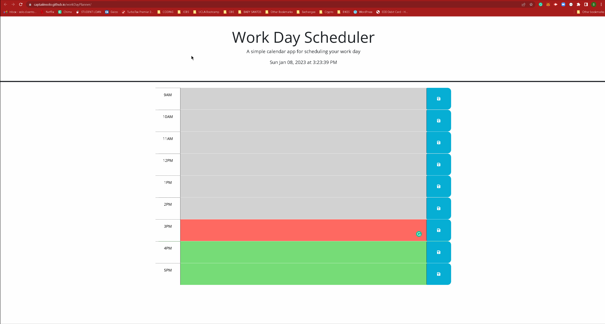

# Work Day Scheduler

## Technology Used
| Technology Used         | Resource URL           | 
| ------------- |:-------------:| 
| HTML    | [MDN - HTML](https://developer.mozilla.org/en-US/docs/Web/HTML) | 
| JavaScript | [MDN - JS](https://developer.mozilla.org/en-US/docs/Web/JavaScript) |
| CSS     | [MDN - CSS](https://developer.mozilla.org/en-US/docs/Web/CSS) |   
| Git | [Git](https://git-scm.com/)|    
|jQuery | [jQuery Docs](https://api.jquery.com/) |
|Day.js | [Day.js Docs](https://day.js.org/docs/en/installation/installation) |

## Description

[Visit the deployed site](https://captaiiinsolo.github.io/workDayPlanner/)

For this project I was asked to create a day scheduler for a busy employee who wanted a simple way to track their work day. When the user opens the webpage they are immediately taken to the work day scheduler where they can see the current date and time displayed at the top of the page. Below the current date and time display is the scheduler itself. Depending on the time of day the time blocks will display 1 of 3 background colors indicating that the time block is either in the past (light gray), present (red), or future (green). The is able to enter calendar events in the text area section of the planner and can save the event via the corresponding save button. When the user closes and returns to the webpage, their saved entries will still be displayed. 

## Usage

## Author Information

Solomon Santos is currently a student at the UC Berkeley Coding Bootcamp for full stack web development, where he is expected to graduate in March 2023.

[LinkedIn](https://www.linkedin.com/in/solomon-santos)
[GitHub](https://www.github.com/captaiiinsolo)
[Twitter](https://twitter.com/captaiiinsolo)

